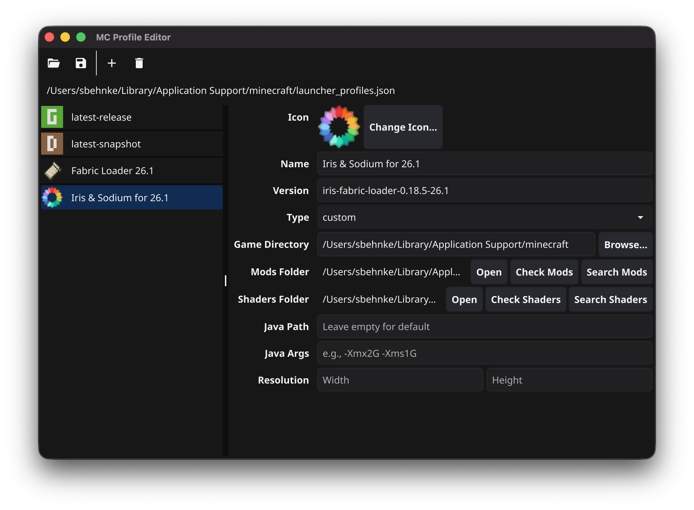

# MC Profile Editor

A cross-platform tool for managing Minecraft profiles and mods. Ships as:

- A **GUI** for the Minecraft launcher's `launcher_profiles.json` (Go + [Fyne](https://fyne.io)).
- A **TUI** (`mcprofiles-tui`) for headless Linux servers that scans a mods folder and checks/updates mods on Modrinth (Go + [Bubble Tea](https://github.com/charmbracelet/bubbletea)).



## Features

- **Load & save** `launcher_profiles.json` with lossless round-trip (preserves all fields)
- **Auto-detects** the profiles file across OS-specific and launcher-variant paths
- **View and edit** all profile fields: name, version, type, game directory, Java path, Java args, resolution
- **Profile icons**: displays base64-encoded custom icons and generates colored placeholders for named icons (Grass, Dirt, Diamond, etc.)
- **Icon picker**: choose from 25 built-in Minecraft icon names or select a custom image
- **Mods folder detection**: resolves the effective mods folder by inspecting version JSON for `-Dfabric.modsFolder=` overrides, with an **Open in Finder/Explorer/Files** button
- **Add and delete** profiles with confirmation dialogs
- **Remembers** the last opened file between sessions

## Detected Profile Paths

The app automatically searches these locations:

| OS | Paths |
|----|-------|
| **macOS** | `~/Library/Application Support/minecraft/` |
| **Windows** | `%APPDATA%\.minecraft/` |
| **Windows** (MS Store) | `%LOCALAPPDATA%\Packages\Microsoft.4297127D64EC6_8wekyb3d8bbwe\LocalCache\Local\minecraft\` |
| **Linux** | `~/.minecraft/` |
| **Linux** (Flatpak) | `~/.var/app/com.mojang.Minecraft/.minecraft/` |
| **Linux** (Snap) | `~/snap/mc-installer/current/.minecraft/` |

Both `launcher_profiles.json` and `launcher_profiles_microsoft_store.json` are checked at each location. You can also open any file manually via the toolbar.

## Prerequisites

- [Go](https://go.dev/dl/) 1.21+
- C compiler (required by Fyne's OpenGL backend)
  - **macOS**: Xcode Command Line Tools (`xcode-select --install`)
  - **Linux**: `gcc`, `libgl1-mesa-dev`, `xorg-dev` (Debian/Ubuntu) or equivalent
  - **Windows**: [MSYS2](https://www.msys2.org/) with MinGW-w64, or TDM-GCC

## Building

### macOS

```bash
./build-macos.sh
open "build/MC Profile Editor.app"
```

Produces a full `.app` bundle with:
- `AppIcon.icon` for macOS Tahoe (layered, gradient, dynamic rendering)
- `AppIcon.icns` fallback for pre-Tahoe (gradient baked in from `icon.json`)

#### Code signing & notarization

The build script supports signing and notarization via environment variables:

```bash
# Find your signing identity
security find-identity -v -p codesigning

# Store notarization credentials (one-time setup)
xcrun notarytool store-credentials "MCProfiles" \
  --apple-id you@example.com \
  --team-id YOURTEAMID \
  --password <app-specific-password>

# Build with signing + notarization
CODESIGN_IDENTITY="Developer ID Application: Your Name (TEAMID)" \
NOTARIZE_PROFILE="MCProfiles" \
./build-macos.sh
```

| Variable | Effect |
|----------|--------|
| `CODESIGN_IDENTITY` | Signs with the given identity. Use `"-"` for ad-hoc signing. |
| `NOTARIZE_PROFILE` | Submits to Apple, waits, and staples the ticket. Requires a valid (non-ad-hoc) signing identity. |

Both are optional — omit them for an unsigned development build.

### Linux

```bash
./build-linux.sh
./build/mcprofiles/mcprofiles
```

Produces a directory with the binary, `.desktop` file, SVG icon, and an `install.sh` script:

```bash
cd build/mcprofiles
./install.sh              # installs to /usr/local
./install.sh /usr         # or specify a prefix
```

### Windows

**Native build** (from Git Bash, MSYS2, or WSL):

```bash
./build-windows.sh
```

**Cross-compile from macOS or Linux** (requires MinGW):

```bash
# Install cross-compiler
brew install mingw-w64          # macOS
sudo apt install gcc-mingw-w64  # Debian/Ubuntu

./build-windows.sh
```

Produces `build/mcprofiles-windows/mcprofiles.exe`.

#### Windows ARM64 note

The native ARM64 build uses OpenGL ES (via Fyne's `arm64` build tags) and requires ANGLE DLLs (`libEGL.dll` and `libGLESv2.dll`) in the same directory as the exe. Without them, the window opens but nothing renders.

**Workaround options:**
1. **Use the amd64 build** — Windows ARM64 runs x86_64 apps via emulation with no setup needed
2. **Copy ANGLE DLLs** from an installed Chromium-based browser (Edge, Chrome) into the same folder as `mcprofiles.exe`:
   ```powershell
   copy "C:\Program Files (x86)\Microsoft\Edge\Application\<version>\libEGL.dll" .
   copy "C:\Program Files (x86)\Microsoft\Edge\Application\<version>\libGLESv2.dll" .
   ```

### Docker multi-arch build (all platforms)

Builds Linux and Windows binaries for both amd64 and arm64 using Docker:

```bash
./build-docker.sh
```

Produces 4 archives in `build/release/`:

| Artifact | Platform |
|----------|----------|
| `mcprofiles-linux-amd64.tar.gz` | Linux x86_64 |
| `mcprofiles-linux-arm64.tar.gz` | Linux aarch64 |
| `mcprofiles-windows-amd64.zip` | Windows x86_64 |
| `mcprofiles-windows-arm64.zip` | Windows ARM64 |

Requires Docker with buildx. On Apple Silicon, arm64 containers run natively and amd64 via Rosetta.

### Linux server (TUI, headless)

For headless Linux servers where the GUI can't run, `mcprofiles-tui` is a small
static binary with no OpenGL or C dependencies. It manages a list of server
mod folders and checks/updates them against Modrinth.

```bash
./build-linux-server.sh
```

Produces two static binaries under `build/mcprofiles-tui/`:

| Artifact | Platform |
|----------|----------|
| `mcprofiles-tui-linux-amd64` | Linux x86_64 |
| `mcprofiles-tui-linux-arm64` | Linux aarch64 |

Or build on the server itself:

```bash
go build -tags headless -o mcprofiles-tui .
./mcprofiles-tui
```

**Config file**: `~/.config/mcprofiles/servers.toml` (honors `$XDG_CONFIG_HOME`; override with `$MCPROFILES_CONFIG`).

Each server entry holds:

| Field | Required | Description |
|-------|----------|-------------|
| `name` | yes | Display name |
| `mods_dir` | yes | Absolute path to the server's `mods/` folder |
| `server_jar` | no | Path to the server jar; `ctrl+d` in the editor auto-detects `game_version` and `loader` from it |
| `game_version` | no | e.g. `1.21.4` — needed for update checks |
| `loader` | no | `fabric`, `forge`, `neoforge`, `quilt`, `paper`, or `vanilla` |
| `java_path` | no | Reserved for future use |

**Keys**: `a` add · `e` edit · `d` delete · `enter` open mods · `u` update selected · `U` update all · `r` refresh · `esc` back · `q` quit.

### GitHub Actions release build

Linux x86_64 and Windows x86_64 release archives can be built in GitHub Actions by pushing a `v*` tag. The workflow uploads those artifacts to the matching GitHub release. macOS remains a local build because signing and notarization use local Apple credentials.

ARM64 release artifacts are not built in GitHub Actions by default. They are slower to produce and the Linux ARM64 build has been less reliable in testing, so those builds remain better candidates for manual or separate follow-up builds.

Release/package version metadata is sourced from the top-level `VERSION` file. Build scripts also allow overriding it via the `VERSION` environment variable when needed.

### Quick build (any platform, no packaging)

```bash
go build -o mcprofiles .
./mcprofiles
```

## Project Structure

```
MCProfiles/
  profiles.go        JSON types, custom marshal/unmarshal, load/save, path detection
  modrinth.go        Modrinth API client, CheckMods, update/install helpers
  jarparse.go        Mod jar metadata parser (fabric.mod.json, mods.toml)
  shaders.go         Shader pack scanning + CheckShaders (pure logic)
  servers.go         TUI config (servers.toml) load/save
  serverdetect.go    Parse server.jar to detect game version + loader

  main.go            GUI entry point (Fyne; build tag: !headless)
  icons.go           Icon decoding + placeholder generation (Fyne)
  ui_*.go            GUI screens (list, detail, mods, search, versions, shaders)

  tui_main.go        TUI entry point (Bubble Tea; build tag: headless)
  tui_servers.go     TUI server list + editor screens
  tui_mods.go        TUI mod list screen (check + update)

  resources/
    AppIcon.icon/    macOS Icon Composer bundle (Tahoe-style layered icon)

  build-macos.sh         macOS .app bundle with codesign & notarization
  build-linux.sh         Linux GUI build with .desktop integration
  build-linux-server.sh  Linux headless TUI build (static, no CGO)
  build-windows.sh       Windows build (native or cross-compile)
  build-docker.sh        Docker multi-arch build (Linux + Windows, amd64 + arm64)
  Dockerfile             Build container with Fyne deps + MinGW + llvm-mingw
```

## License

MIT
